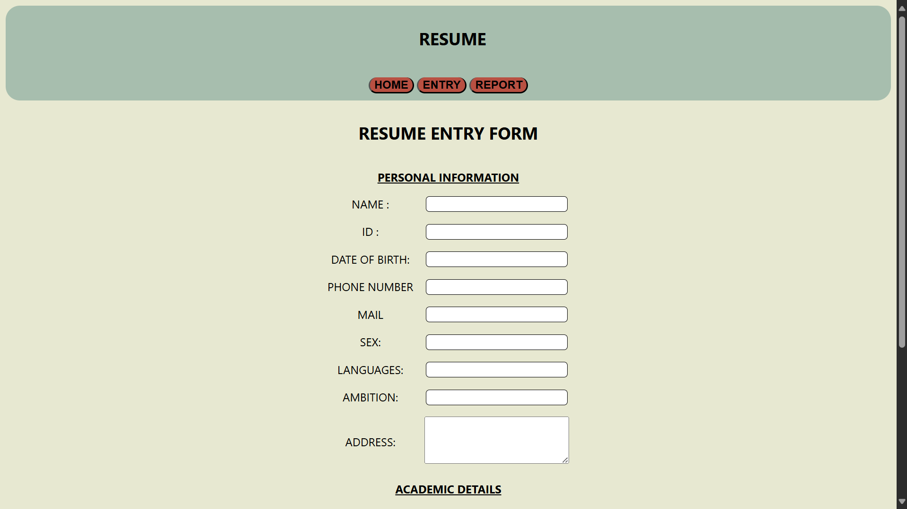

# Resume Store in Django
This is a Django-based Resume Entry Form that allows users to add a Employee or Student details into a database. It demonstrates Django.

## Features 
- ✅ Add Student and Employee Details to database
- ✅ Form validation using Django Forms
- ✅ Store data in a SQLite
- ✅ View and delete Information entries
- ✅ User-friendly interface

## 🛠️ Technologies Used 
- Django
- HTML
- CSS
- javascript 
- SQLite (Database) 

## 🚀 Installation & Setup 
1. Clone the Repository
``` bash
    git clone https://github.com/GOKUL988/Resume-store-in-Django-.git
```

2. Navigate to the project folder: 
``` bash
    cd Resume-store-in-Django-
```
3. Install Dependencies 
``` bash 
    pip install -r requirements.txt  
```
4. Apply Migrations 
``` bash 
    python manage.py migrate  
```
5. Run the Development 
``` bash 
    python manage.py runserver  
```

## sample Images 

# 

# 

# 

# 

# 

# 

